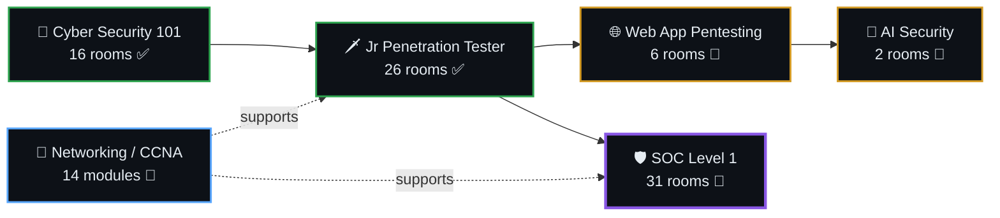

<div align="center">

# 🧠 Penetration Testing & SOC Methodology Documentation

**Cybersecurity Notes — Rahul Sunouri**

*A structured, room-by-room knowledge base built while working through TryHackMe —*
*from offensive fundamentals to blue-team detection engineering.*

<br>

[](https://tryhackme.com/p/Ethrahul)
[](https://linkedin.com/in/rahul-sunouri)


</div>

---

## 📊 At a Glance

| Path | Modules | Notes | Status |
|:---|:---:|:---:|:---|
| [Cyber Security 101](#cs101) | 4 | 16 | ✅ Complete |
| [Jr Penetration Tester](#jrpt) | 5 | 26 | ✅ Complete |
| [Web Application Pentesting](#webapp) | 2 | 6 | 🔄 In progress |
| [AI Security](#aisec) | 1 | 2 | 🔄 In progress |
| [**SOC Level 1**](#soc) | **8** | **31** | 🔄 **In progress — active focus** |
| [Network Fundamentals (CCNA)](#ccna) | 1 | 14 | 🔄 In progress |

> **Legend** — 🟢 Easy · 🟡 Medium · 🔴 Hard · ✅ Complete · 🔄 In progress · ⏳ Planned

---

## 🗂️ Index

- [📁 Cyber Security 101](#cs101) — *offensive fundamentals*
  - [Exploitation Basics](#cs101-exploit) · [Web Hacking](#cs101-web) · [Offensive Security Tooling](#cs101-tooling) · [OWASP Top 10](#cs101-owasp)
- [📁 Jr Penetration Tester](#jrpt) — *the full pentest workflow*
  - [Introduction to Web Hacking](#jrpt-web) · [Burp Suite](#jrpt-burp) · [Network Security](#jrpt-netsec) · [Vulnerability Research](#jrpt-vuln) · [Privilege Escalation](#jrpt-privesc)
- [📁 Web Application Pentesting](#webapp) — *deep web app offence*
  - [Authentication](#webapp-auth) · [Vulnerabilities](#webapp-vulns)
- [📁 AI Security](#aisec) — *LLM & ML attack surface*
- [🛡️ SOC Level 1](#soc) — *blue team: detection, triage, forensics*
  - [Core SOC Solutions](#soc-core) · [Cyber Defence Frameworks](#soc-frameworks) · [Network Traffic Analysis](#soc-nta) · [Network Security Monitoring](#soc-nsm) · [Web Security Monitoring](#soc-web) · [Windows Security Monitoring](#soc-windows) · [Malware Concepts for SOC](#soc-malware) · [Linux Security Monitoring](#soc-linux)
- [📁 Network Fundamentals — CCNA](#ccna) — *the infrastructure layer*
- [🧩 How These Notes Are Built](#method)

---

## 🗺️ The Route So Far



---

<a id="soc"></a>

## 🛡️ SOC Level 1 — *Blue Team Operations*

> **Active path.** Where the offensive paths taught how attacks are built, this one is about seeing them happen: log sources, SIEM queries, packet captures, IDS rules and host telemetry — then turning all of it into detection.

**8 modules · 31 rooms documented · May 2026 → present**

<a id="soc-core"></a>

<details open>
<summary><b>01 · Core SOC Solutions</b> — SIEM, EDR, SOAR and the analyst's toolbench &nbsp;<code>5 rooms</code></summary>

<br>

| Room | Difficulty | Notes |
|:---|:---:|:---|
| Introduction to SIEM | 🟢 Easy | [View](05-SOC-Level-1/01-Core-SOC-Solutions/Introduction-to-SIEM.md) |
| Introduction to EDR | 🟢 Easy | [View](05-SOC-Level-1/01-Core-SOC-Solutions/Introduction-to-EDR.md) |
| Introduction to SOAR | 🟢 Easy | [View](05-SOC-Level-1/01-Core-SOC-Solutions/Introduction-to-SOAR.md) |
| Splunk: The Basics | 🟢 Easy | [View](05-SOC-Level-1/01-Core-SOC-Solutions/Splunk-The-Basics.md) |
| Elastic Stack: The Basics | 🟢 Easy | [View](05-SOC-Level-1/01-Core-SOC-Solutions/Elastic-Stack-The-Basics.md) |

</details>

<a id="soc-frameworks"></a>

<details>
<summary><b>02 · Cyber Defence Frameworks</b> — the models analysts reason with &nbsp;<code>4 rooms</code></summary>

<br>

| Room | Difficulty | Notes |
|:---|:---:|:---|
| Pyramid of Pain | 🟢 Easy | [View](05-SOC-Level-1/02-Cyber-Defence-Frameworks/Pyramid-of-Pain.md) |
| Cyber Kill Chain | 🟢 Easy | [View](05-SOC-Level-1/02-Cyber-Defence-Frameworks/Cyber-Kill-Chain.md) |
| Unified Kill Chain | 🟢 Easy | [View](05-SOC-Level-1/02-Cyber-Defence-Frameworks/Unified-Kill-Chain.md) |
| MITRE (ATT&CK, CAR, ENGAGE, D3FEND) | 🟢 Easy | [View](05-SOC-Level-1/02-Cyber-Defence-Frameworks/MITRE.md) |

</details>

<a id="soc-nta"></a>

<details>
<summary><b>03 · Network Traffic Analysis</b> — reading the wire &nbsp;<code>5 rooms</code></summary>

<br>

| Room | Difficulty | Notes |
|:---|:---:|:---|
| Network Traffic Basics | 🟢 Easy | [View](05-SOC-Level-1/03-Network-Traffic-Analysis/Network-Traffic-Basics.md) |
| Wireshark: The Basics | 🟢 Easy | [View](05-SOC-Level-1/03-Network-Traffic-Analysis/Wireshark-The-Basics.md) |
| Wireshark: Packet Operations | 🟡 Medium | [View](05-SOC-Level-1/03-Network-Traffic-Analysis/Wireshark-Packet-Operations.md) |
| Wireshark: Traffic Analysis | 🟡 Medium | [View](05-SOC-Level-1/03-Network-Traffic-Analysis/Wireshark-Traffic-Analysis.md) |
| NetworkMiner | 🟢 Easy | [View](05-SOC-Level-1/03-Network-Traffic-Analysis/NetworkMiner.md) |

</details>

<a id="soc-nsm"></a>

<details>
<summary><b>04 · Network Security Monitoring</b> — detecting recon, MITM, exfil &nbsp;<code>5 rooms</code></summary>

<br>

| Room | Difficulty | Notes |
|:---|:---:|:---|
| Network Security Essentials | 🟢 Easy | [View](05-SOC-Level-1/04-Network-Security-Monitoring/Network-Security-Essentials.md) |
| Network Discovery Detection | 🟢 Easy | [View](05-SOC-Level-1/04-Network-Security-Monitoring/Network-Discovery-Detection.md) |
| Man-in-the-Middle Detection | 🟢 Easy | [View](05-SOC-Level-1/04-Network-Security-Monitoring/Man-in-the-Middle-Detection.md) |
| Data Exfiltration Detection | 🟢 Easy | [View](05-SOC-Level-1/04-Network-Security-Monitoring/Data-Exfiltration-Detection.md) |
| Snort | 🔴 Hard | [View](05-SOC-Level-1/04-Network-Security-Monitoring/Snort.md) |

</details>

<a id="soc-web"></a>

<details>
<summary><b>05 · Web Security Monitoring</b> — attacks as they look from the defender's side &nbsp;<code>3 rooms</code></summary>

<br>

| Room | Difficulty | Notes |
|:---|:---:|:---|
| Web Security Essentials | 🟢 Easy | [View](05-SOC-Level-1/05-Web-Security-Monitoring/Web-Security-Essentials.md) |
| Detecting Web Attacks | 🟢 Easy | [View](05-SOC-Level-1/05-Web-Security-Monitoring/Detecting-Web-Attacks.md) |
| Detecting Web Shells | 🟢 Easy | [View](05-SOC-Level-1/05-Web-Security-Monitoring/Detecting-Web-Shells.md) |

</details>

<a id="soc-windows"></a>

<details>
<summary><b>06 · Windows Security Monitoring</b> — Event Logs, Sysmon, intrusion stages &nbsp;<code>4 rooms</code></summary>

<br>

| Room | Difficulty | Notes |
|:---|:---:|:---|
| Windows Logging for SOC | 🟢 Easy | [View](05-SOC-Level-1/06-Windows-Security-Monitoring/Windows-Logging-for-SOC.md) |
| Windows Threat Detection 1 — *initial access* | 🟢 Easy | [View](05-SOC-Level-1/06-Windows-Security-Monitoring/Windows-Threat-Detection-1.md) |
| Windows Threat Detection 2 — *discovery → exfil* | 🟢 Easy | [View](05-SOC-Level-1/06-Windows-Security-Monitoring/Windows-Threat-Detection-2.md) |
| Windows Threat Detection 3 — *C2, persistence, impact* | 🟢 Easy | [View](05-SOC-Level-1/06-Windows-Security-Monitoring/Windows-Threat-Detection-3.md) |

</details>

<a id="soc-malware"></a>

<details>
<summary><b>07 · Malware Concepts for SOC</b> — classification drives response &nbsp;<code>1 room</code></summary>

<br>

| Room | Difficulty | Notes |
|:---|:---:|:---|
| Malware Classification | 🟢 Easy | [View](05-SOC-Level-1/07-Malware-Concepts-for-SOC/Malware-Classification.md) |

</details>

<a id="soc-linux"></a>

<details open>
<summary><b>08 · Linux Security Monitoring</b> — auditd, process trees, botnet case study &nbsp;<code>4 rooms</code></summary>

<br>

| Room | Difficulty | Notes |
|:---|:---:|:---|
| Linux Logging for SOC | 🟢 Easy | [View](05-SOC-Level-1/08-Linux-Security-Monitoring/Linux-Logging-for-SOC.md) |
| Linux Threat Detection 1 — *initial access* | 🟡 Medium | [View](05-SOC-Level-1/08-Linux-Security-Monitoring/Linux-Threat-Detection-1.md) |
| Linux Threat Detection 2 — *discovery & Dota3 botnet* | 🟡 Medium | [View](05-SOC-Level-1/08-Linux-Security-Monitoring/Linux-Threat-Detection-2.md) |
| Linux Threat Detection 3 — *privesc & persistence* | 🟡 Medium | [View](05-SOC-Level-1/08-Linux-Security-Monitoring/Linux-Threat-Detection-3.md) |

</details>

---

<a id="cs101"></a>

## 📁 Cyber Security 101

> Where it started — the offensive fundamentals: exploitation frameworks, web basics and the standard tooling.

**4 modules · 16 rooms · Completed March 2026**

<a id="cs101-exploit"></a>

<details>
<summary><b>Exploitation Basics</b> &nbsp;<code>5 rooms</code></summary>

<br>

| Room | Difficulty | Notes |
|:---|:---:|:---|
| Metasploit: Introduction | 🟢 Easy | [View](01-CyberSec-101/Exploitation-Basics/Metasploit-Introduction.md) |
| Metasploit: Exploitation | 🟢 Easy | [View](01-CyberSec-101/Exploitation-Basics/Metasploit-Exploitation.md) |
| Metasploit: Meterpreter | 🟢 Easy | [View](01-CyberSec-101/Exploitation-Basics/Metasploit-Meterpreter.md) |
| Blue — MS17-010 EternalBlue | 🟢 Easy | [View](01-CyberSec-101/Exploitation-Basics/Blue.md) |
| Moniker Link — CVE-2024-21413 | 🟢 Easy | [View](01-CyberSec-101/Exploitation-Basics/Moniker-Link.md) |

</details>

<a id="cs101-web"></a>

<details>
<summary><b>Web Hacking</b> &nbsp;<code>4 rooms</code></summary>

<br>

| Room | Difficulty | Notes |
|:---|:---:|:---|
| Web Application Basics | 🟢 Easy | [View](01-CyberSec-101/Web-Hacking/Web-Application-Basics.md) |
| JavaScript Essentials | 🟢 Easy | [View](01-CyberSec-101/Web-Hacking/JavaScript-Essentials.md) |
| SQL Fundamentals | 🟢 Easy | [View](01-CyberSec-101/Web-Hacking/SQL-Fundamentals.md) |
| Burp Suite: The Basics | 🟢 Easy | [View](01-CyberSec-101/Web-Hacking/Burp-Suite-Basics.md) |

</details>

<a id="cs101-tooling"></a>

<details>
<summary><b>Offensive Security Tooling</b> &nbsp;<code>4 rooms</code></summary>

<br>

| Room | Difficulty | Notes |
|:---|:---:|:---|
| Hydra | 🟢 Easy | [View](01-CyberSec-101/Offensive-Security-Tooling/Hydra.md) |
| Gobuster: The Basics | 🟢 Easy | [View](01-CyberSec-101/Offensive-Security-Tooling/Gobuster-Basics.md) |
| Shells Overview | 🟢 Easy | [View](01-CyberSec-101/Offensive-Security-Tooling/Shells-Overview.md) |
| SQLMap: The Basics | 🟢 Easy | [View](01-CyberSec-101/Offensive-Security-Tooling/SQLMap-Basics.md) |

</details>

<a id="cs101-owasp"></a>

<details>
<summary><b>OWASP Top 10 (2025)</b> &nbsp;<code>3 rooms</code></summary>

<br>

| Room | Difficulty | Notes |
|:---|:---:|:---|
| IAAA Failures | 🟢 Easy | [View](01-CyberSec-101/OWASP-Top-10/OWASP-Top10-IAAA-Failures.md) |
| Application Design Flaws | 🟢 Easy | [View](01-CyberSec-101/OWASP-Top-10/OWASP-Top10-Application-Design-Flaws.md) |
| Insecure Data Handling | 🟢 Easy | [View](01-CyberSec-101/OWASP-Top-10/OWASP-Top10-Insecure-Data-Handling.md) |

</details>

---

<a id="jrpt"></a>

## 📁 Jr Penetration Tester

> The full engagement workflow — recon, web exploitation, vulnerability research and privilege escalation on both Linux and Windows.

**5 modules · 26 rooms · Completed April 2026**

<a id="jrpt-web"></a>

<details>
<summary><b>Introduction to Web Hacking</b> &nbsp;<code>11 rooms</code></summary>

<br>

| Room | Difficulty | Notes |
|:---|:---:|:---|
| Walking An Application | 🟢 Easy | [View](02-Jr-Pentesting-Path/Introduction-to-Web-Hacking/Walking-An-Application.md) |
| Content Discovery | 🟢 Easy | [View](02-Jr-Pentesting-Path/Introduction-to-Web-Hacking/Content-Discovery.md) |
| Subdomain Enumeration | 🟢 Easy | [View](02-Jr-Pentesting-Path/Introduction-to-Web-Hacking/Subdomain-Enumeration.md) |
| Authentication Bypass | 🟢 Easy | [View](02-Jr-Pentesting-Path/Introduction-to-Web-Hacking/Authentication-Bypass.md) |
| IDOR | 🟢 Easy | [View](02-Jr-Pentesting-Path/Introduction-to-Web-Hacking/IDOR.md) |
| File Inclusion | 🟢 Easy | [View](02-Jr-Pentesting-Path/Introduction-to-Web-Hacking/File-Inclusion.md) |
| Intro to SSRF | 🟢 Easy | [View](02-Jr-Pentesting-Path/Introduction-to-Web-Hacking/SSRF.md) |
| XSS — Intro to Cross-site Scripting | 🟢 Easy | [View](02-Jr-Pentesting-Path/Introduction-to-Web-Hacking/XSS-Intro.md) |
| SQL Injection | 🟢 Easy | [View](02-Jr-Pentesting-Path/Introduction-to-Web-Hacking/SQL-Injection.md) |
| Command Injection | 🟢 Easy | [View](02-Jr-Pentesting-Path/Introduction-to-Web-Hacking/Command-Injection.md) |
| Race Conditions | 🟡 Medium | [View](02-Jr-Pentesting-Path/Introduction-to-Web-Hacking/Race-Conditions.md) |

</details>

<a id="jrpt-burp"></a>

<details>
<summary><b>Burp Suite</b> &nbsp;<code>3 rooms</code></summary>

<br>

| Room | Difficulty | Notes |
|:---|:---:|:---|
| Burp Suite: Repeater | 🟢 Easy | [View](02-Jr-Pentesting-Path/Burp-Suite/Burp-Suite-Repeater.md) |
| Burp Suite: Intruder | 🟢 Easy | [View](02-Jr-Pentesting-Path/Burp-Suite/Burp-Suite-Intruder.md) |
| Burp Suite: Other Modules | 🟢 Easy | [View](02-Jr-Pentesting-Path/Burp-Suite/Burp-Suite-Other-Modules.md) |

</details>

<a id="jrpt-netsec"></a>

<details>
<summary><b>Network Security</b> &nbsp;<code>7 rooms</code></summary>

<br>

| Room | Difficulty | Notes |
|:---|:---:|:---|
| Passive Reconnaissance | 🟢 Easy | [View](02-Jr-Pentesting-Path/Network-Security/Passive-Reconnaissance.md) |
| Active Reconnaissance | 🟢 Easy | [View](02-Jr-Pentesting-Path/Network-Security/Active-Reconnaissance.md) |
| Nmap: Live Host Discovery | 🟢 Easy | [View](02-Jr-Pentesting-Path/Network-Security/Nmap-Live-Host-Discovery.md) |
| Nmap: Basic Port Scans | 🟢 Easy | [View](02-Jr-Pentesting-Path/Network-Security/Nmap-Basic-Port-Scans.md) |
| Nmap: Advanced Port Scans | 🟢 Easy | [View](02-Jr-Pentesting-Path/Network-Security/Nmap-Advanced-Port-Scans.md) |
| Nmap: Post Port Scans | 🟢 Easy | [View](02-Jr-Pentesting-Path/Network-Security/Nmap-Post-Port-Scans.md) |
| Protocols and Servers 1 & 2 | 🟢 Easy | [View](02-Jr-Pentesting-Path/Network-Security/Protocols-and-Servers-Combined.md) |

</details>

<a id="jrpt-vuln"></a>

<details>
<summary><b>Vulnerability Research</b> &nbsp;<code>2 rooms</code></summary>

<br>

| Room | Difficulty | Notes |
|:---|:---:|:---|
| Vulnerabilities 101 | 🟢 Easy | [View](02-Jr-Pentesting-Path/Vulnerability-Research/Vulnerabilities-101.md) |
| Exploit Vulnerabilities | 🟢 Easy | [View](02-Jr-Pentesting-Path/Vulnerability-Research/Exploit-Vulnerabilities.md) |

</details>

<a id="jrpt-privesc"></a>

<details>
<summary><b>Privilege Escalation</b> &nbsp;<code>3 rooms</code></summary>

<br>

| Room | Difficulty | Notes |
|:---|:---:|:---|
| What the Shell? | 🟢 Easy | [View](02-Jr-Pentesting-Path/Privilege-Escalation/What-The-Shell.md) |
| Linux Privilege Escalation | 🟡 Medium | [View](02-Jr-Pentesting-Path/Privilege-Escalation/Linux-Privilege-Escalation.md) |
| Windows Privilege Escalation | 🟡 Medium | [View](02-Jr-Pentesting-Path/Privilege-Escalation/Windows-Privilege-Escalation.md) |

</details>

---

<a id="webapp"></a>

## 📁 Web Application Pentesting

> Going deeper than the intro path — auth logic, token handling and the flaws that only show up when you understand the protocol.

**2 modules · 6 rooms · In progress**

<a id="webapp-auth"></a>

<details>
<summary><b>Authentication</b> &nbsp;<code>5 rooms</code></summary>

<br>

| Room | Difficulty | Notes |
|:---|:---:|:---|
| Enumeration & Brute Force | 🟢 Easy | [View](03-Web-App-Pentesting/Authentication/Enumeration-and-Brute-Force.md) |
| Session Management | 🟡 Medium | [View](03-Web-App-Pentesting/Authentication/Session-Management.md) |
| OAuth Vulnerabilities | 🟡 Medium | [View](03-Web-App-Pentesting/Authentication/OAuth-Vulnerabilities.md) |
| JWT Security | 🟡 Medium | [View](03-Web-App-Pentesting/Authentication/JWT-Security.md) |
| Multi-Factor Authentication | 🟡 Medium | [View](03-Web-App-Pentesting/Authentication/Multi-Factor-Authentication.md) |

</details>

<a id="webapp-vulns"></a>

<details>
<summary><b>Vulnerabilities</b> &nbsp;<code>1 room</code></summary>

<br>

| Room | Difficulty | Notes |
|:---|:---:|:---|
| Upload Vulnerabilities | 🟢 Easy | [View](03-Web-App-Pentesting/Vulnerabilities/Upload-Vulnerabilities.md) |

</details>

---

<a id="aisec"></a>

## 📁 AI Security

> The attack surface that did not exist five years ago — model behaviour, training data and LLM-specific abuse. [Module overview](04-AI-Security/README.md)

| Room | Notes |
|:---|:---|
| AI Models & Data | [View](04-AI-Security/AI-Models-and-Data.md) |
| AI/ML Security Threats | [View](04-AI-Security/AI-ML-Security-Threats.md) |

---

<a id="ccna"></a>

## 📁 Network Fundamentals — CCNA 200-301

> Infrastructure notes taken through an offensive lens: how packets move, where segmentation breaks, and which protocol weaknesses enable enumeration and pivoting. [Module overview](NetworkChuck-CCNA/README.md)

<details>
<summary><b>14 modules</b> — from cabling to hybrid cloud &nbsp;<code>click to expand</code></summary>

<br>

| # | Module | Notes |
|:---:|:---|:---|
| 01 | What is a Network | [View](NetworkChuck-CCNA/01-What-is-a-Network.md) |
| 02 | What is a Switch | [View](NetworkChuck-CCNA/02-What-is-a-Switch.md) |
| 03 | Routers and ARP | [View](NetworkChuck-CCNA/03-Routers-and-ARP.md) |
| 04 | TCP/IP and OSI Models | [View](NetworkChuck-CCNA/04-TCPIP-and-OSI-Models.md) |
| 05 | Packet Flow and Encapsulation | [View](NetworkChuck-CCNA/05-Packet-Flow-and-Encapsulation.md) |
| 06 | Upper OSI Layers and Ports | [View](NetworkChuck-CCNA/06-Upper-OSI-Layers-and-Ports.md) |
| 07 | Network Architecture | [View](NetworkChuck-CCNA/07-Network-Architecture.md) |
| 08 | Data Center Networks | [View](NetworkChuck-CCNA/08-Data-Center-Networks.md) |
| 09 | Wide Area Networks | [View](NetworkChuck-CCNA/09-Wide-Area-Networks.md) |
| 10 | Home Network Security and IP Addressing | [View](NetworkChuck-CCNA/10-Home-Network-Security-and-IP-Addressing.md) |
| 11 | Hybrid Cloud and Microservices | [View](NetworkChuck-CCNA/11-Hybrid-Cloud-and-Microservices.md) |
| 12 | Physical Layer and Ethernet | [View](NetworkChuck-CCNA/12-Physical-Layer-and-Ethernet.md) |
| 13 | Power over Ethernet | [View](NetworkChuck-CCNA/13-Power-over-Ethernet.md) |
| 14 | Fiber Optics and Transceivers | [View](NetworkChuck-CCNA/14-Fiber-Optics-and-Transceivers.md) |

</details>

---

<a id="method"></a>

## 🧩 How These Notes Are Built

Every room follows the same template, so any note can be skimmed in under a minute or read as a full reference:

```text
# Room Name
Path · Date · Difficulty
│
├── Concept sections      → the mechanics, with tables for commands, ports, log IDs
├── Key Terms             → the vocabulary the room assumes you already know
├── My Understanding      → the room explained in plain English, no jargon
└── Related Notes         → wiki-links to every other note that touches the topic
```

**Conventions**

| Rule | Why |
|:---|:---|
| `0N-Path/NN-Module/Room-Name.md` | folders sort in the order they were studied, not alphabetically |
| Flat bullet lists, no nested indentation | keeps rendering identical in Obsidian and on GitHub |
| Tables over prose for commands & artifacts | a note should be usable mid-investigation, not just mid-revision |
| `[[wiki-links]]` between related rooms | the vault behaves as a graph, not a folder of orphans |

> These notes are written for my own recall first. If they help someone else studying the same paths, even better.

---

<div align="center">

### 🔗 More in this repo

[**Room Writeups →**](../writeups) · [**Repository Home →**](../README.md)

<br>

*"The quieter you become, the more you are able to hear."*

</div>
