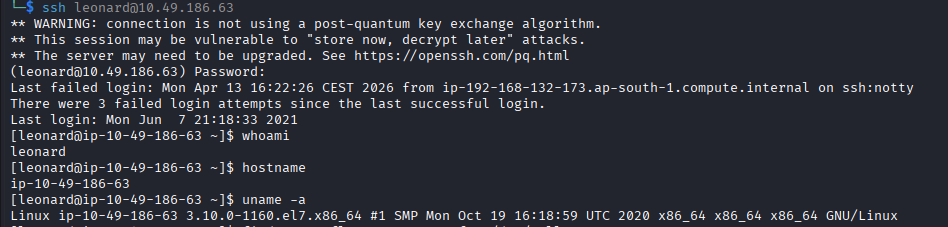
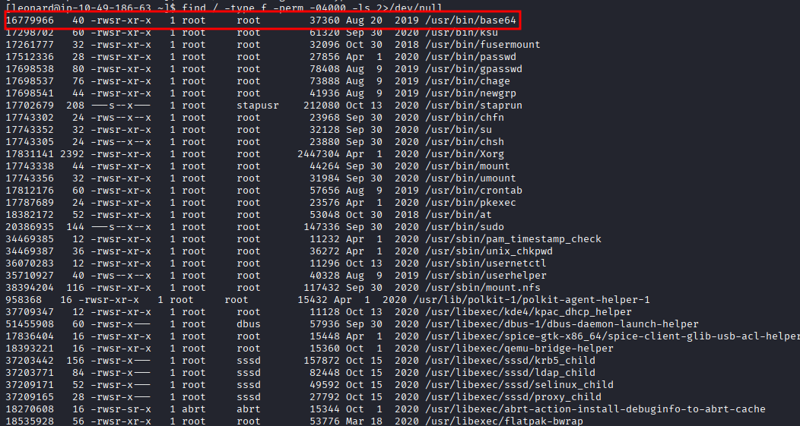
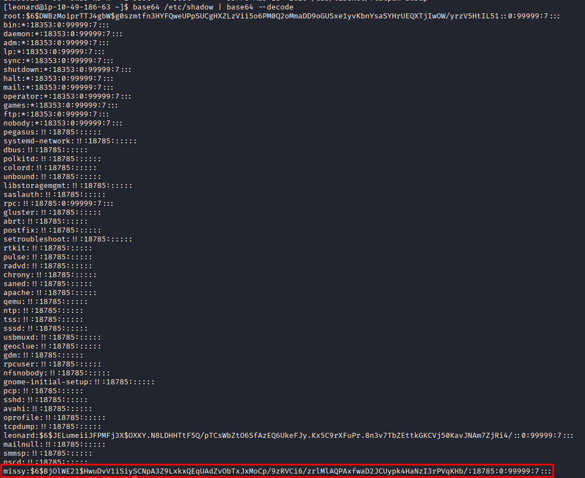
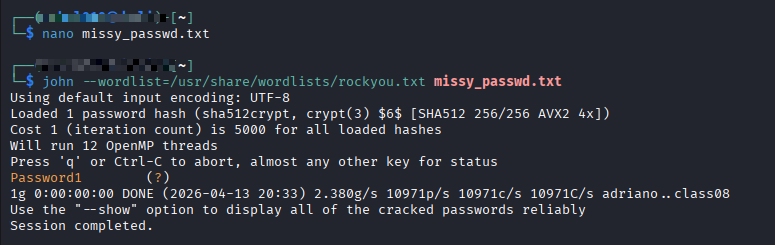
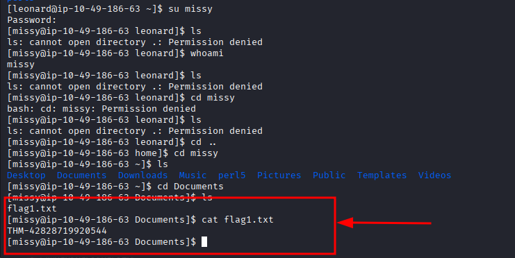
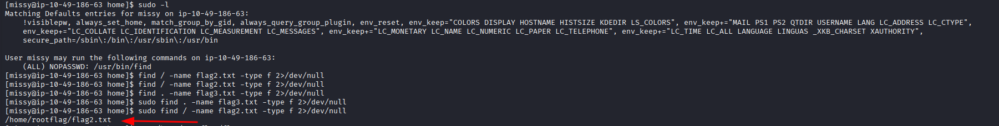
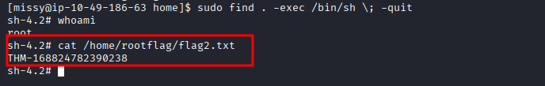

# 🐧 TryHackMe: Linux Privilege Escalation Capstone
**Author:** Rahul Sunouri | **Platform:** TryHackMe | **Path:** Jr Penetration Tester

## 📝 Challenge Overview
The objective of this capstone engagement was to obtain root access on a target Linux machine starting from a low-privileged user account. The engagement required extensive system enumeration, identifying misconfigured file permissions, and leveraging binary exploitation techniques (GTFOBins) to escalate privileges laterally and vertically.

**Target IP:** `10.49.186.63`
**Initial Access:** SSH (`leonard`)

---

## Phase 1: Initial Access & Enumeration
We begin the engagement by establishing an SSH connection to the target utilizing the provided baseline credentials (`leonard:Penny123`). 

```bash
ssh leonard@10.49.186.63
```



Upon successful authentication, standard environmental enumeration (`whoami`, `hostname`, `uname -a`) confirms we are operating in a standard CentOS 7 environment. Our primary objective is to map out the system to find an escalation path.

---

## Phase 2: Lateral Movement (Leonard ➔ Missy)
Initial enumeration of the `/home` directory reveals another user account: `missy`. To escalate vertically to `root`, we often must first move laterally to users with higher base privileges. 

### SUID Enumeration & Exploitation
To find misconfigurations, I executed a system-wide search for binaries with the **SUID (Set Owner User ID)** bit set. This allows a file to execute with the permissions of its owner (in this case, `root`).

```bash
find / -type f -perm -04000 -ls 2>/dev/null
```



The scan revealed a critical vulnerability: the `/usr/bin/base64` binary had the SUID bit set. 

Standard users are blocked from reading the `/etc/shadow` file, which contains the system's password hashes. However, because `base64` executes as `root`, I was able to use it to encode the shadow file, and immediately pipe the output back into a `base64 --decode` command, completely bypassing the file read restrictions.

```bash
base64 /etc/shadow | base64 --decode
```



### Hash Cracking
With the shadow file successfully exfiltrated, I isolated the SHA-512 (`$6$`) password hash for the user `missy`. I transferred this hash to my local Kali attack machine and utilized **John the Ripper** against the `rockyou.txt` wordlist to execute an offline dictionary attack.

```bash
john --wordlist=/usr/share/wordlists/rockyou.txt missy_passwd.txt
```



The hash was successfully cracked, revealing the plaintext password: `Password1`.

### Securing Flag 1
Utilizing the newly acquired credentials, I switched my session to the `missy` user profile and retrieved the first objective flag.

```bash
su missy
cd /home/missy/Documents
cat flag1.txt
```



**User Flag:** `THM-42828719920544`

---

## Phase 3: Vertical Privilege Escalation (Missy ➔ Root)
Operating under the `missy` account, the enumeration phase begins again. 

### Analyzing Sudo Permissions
The standard operating procedure for a new user shell is to check for assigned `sudo` privileges using `sudo -l`. 



This revealed a severe security misconfiguration: the `missy` user was permitted to execute the `/usr/bin/find` binary as `root` without requiring a password (`NOPASSWD`).

Prior to exploitation, I utilized this access to locate the final flag, discovering it housed in the heavily restricted `/home/rootflag/` directory.

### GTFOBins Exploitation
The `find` command contains an `-exec` parameter that allows users to execute arbitrary system commands on the files it locates. Because `find` is being executed with `sudo`, any command spawned via `-exec` inherits those full `root` privileges.

By executing a standard payload from the GTFOBins repository, I was able to break out of the `find` execution flow and drop directly into an interactive root shell.

```bash
sudo find . -exec /bin/sh \; -quit
```



Privilege escalation was verified via the `whoami` command. With full administrative control over the machine, I navigated to the restricted directory and successfully extracted the final flag.

```bash
cat /home/rootflag/flag2.txt
```

**Root Flag:** `THM-168824782390238`

---

## 🛡️ Vulnerability Summary & Remediation
* **Improper SUID Assignment:** The `base64` binary should never have the SUID bit set, as it allows arbitrary read access to the entire filesystem. *Remediation: `chmod -s /usr/bin/base64`*.
* **Weak Passwords:** The user `missy` utilized a highly predictable password (`Password1`) found in common dictionary lists. *Remediation: Enforce strict password complexity requirements.*
* **Excessive Sudo Privileges:** The `NOPASSWD` directive for the `find` command allowed for trivial shell execution. *Remediation: Remove the `find` command from the sudoers file, or restrict its usage strictly to directories that do not allow arbitrary execution.*
