# TryHackMe: Pickle Rick CTF
# 🥒 TryHackMe: Pickle Rick CTF Writeup

**Difficulty:** Easy | **Category:** Web Application Security & Privilege Escalation
**Link:** [Pickle Rick](https://tryhackme.com/room/picklerick)

## 🎯 Objective
This Rick and Morty-themed CTF requires exploiting a web server to find three hidden ingredients required to turn Rick back into a human. This challenge focuses heavily on web enumeration, bypassing command filters, and basic Linux privilege escalation.

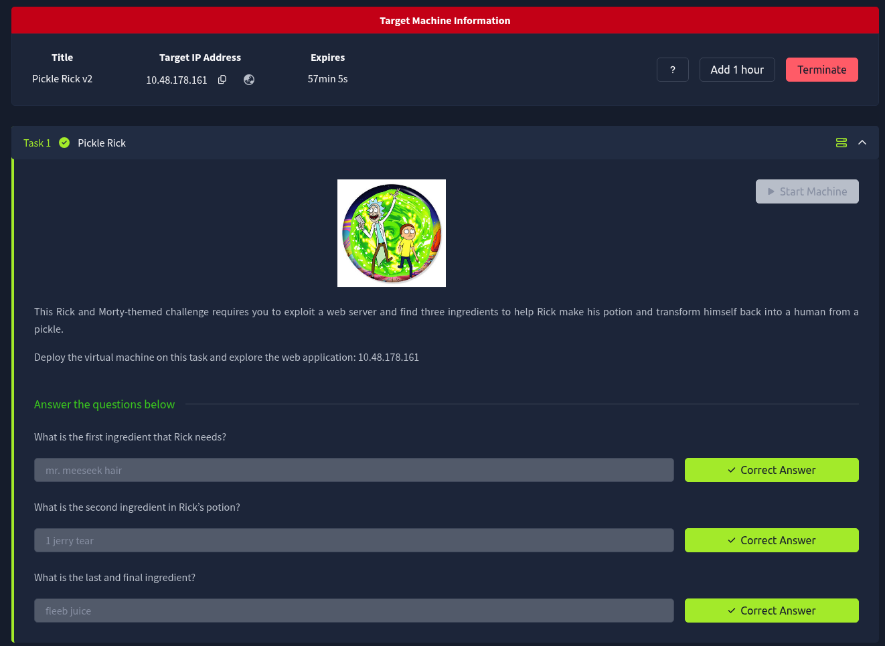

---

## 🛠️ Step 1: Reconnaissance (Nmap)
As with any penetration test, I began by scanning the target IP address to identify open ports and running services.

```bash
nmap -T5 -p- -sV 10.48.178.161 -oA nmap
```

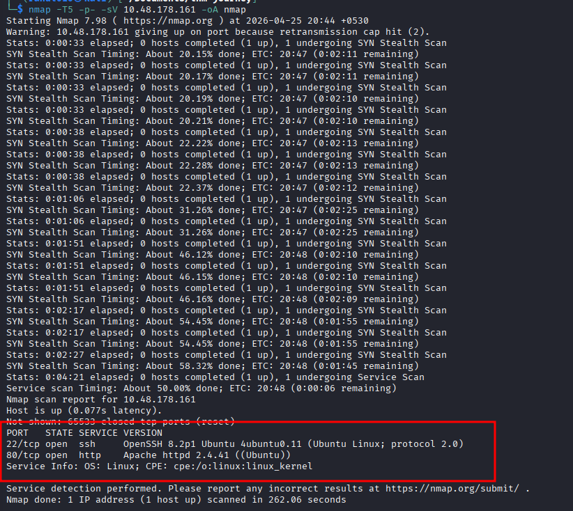

**Results:**
* **Port 22 (SSH):** Open (OpenSSH 8.2p1)
* **Port 80 (HTTP):** Open (Apache 2.4.41)

With port 80 open, the primary attack vector is clearly the web application.

---

## 🕵️‍♂️ Step 2: Web Enumeration & Source Code
Navigating to the web page on port 80, I was greeted by a static HTML page with a plea for help from Rick. To see if the developer left any hidden clues, I inspected the page's source code (`Ctrl+U` or Developer Tools).

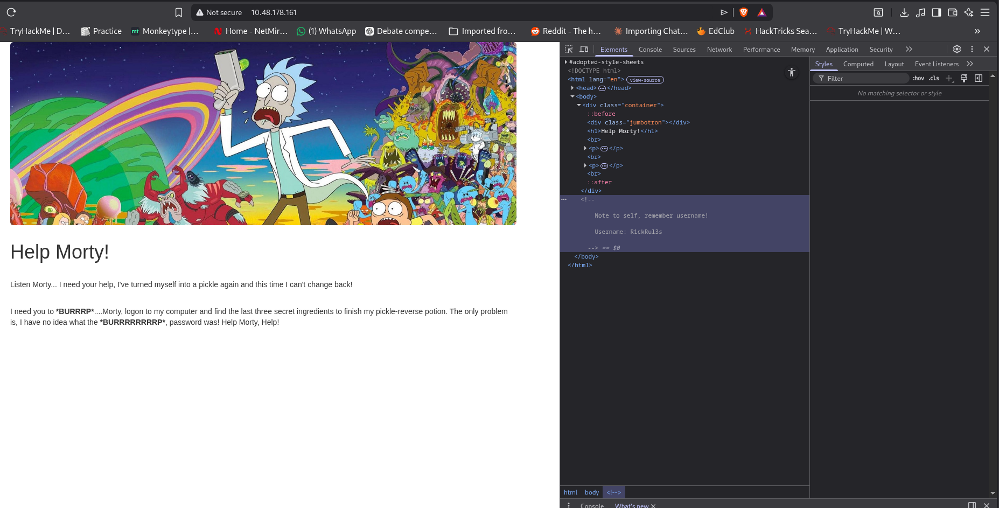

**Bingo!** Hidden inside an HTML comment was a crucial note to self:
* **Username:** `R1ckRul3s`

---

## 🗺️ Step 3: Directory Brute-Forcing
Knowing the username is only half the battle; I needed to find a place to use it. I fired up `gobuster` to map out the hidden directories and files on the web server.

```bash
gobuster dir -u [http://10.48.178.161](http://10.48.178.161) -w /usr/share/wordlists/dirbuster/directory-list-2.3-medium.txt -t 50 -x php,html,txt
```

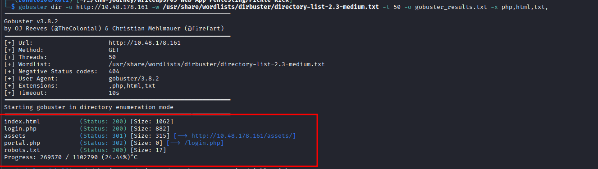

The scan revealed several highly interesting files:
* `login.php` (Our authentication gateway)
* `robots.txt` (A goldmine for hidden paths)
* `portal.php` (Redirects to login)

---

## 🔑 Step 4: Investigating robots.txt
I navigated to `http://10.48.178.161/robots.txt` to see what the site administrator was trying to hide from search engine web crawlers. 

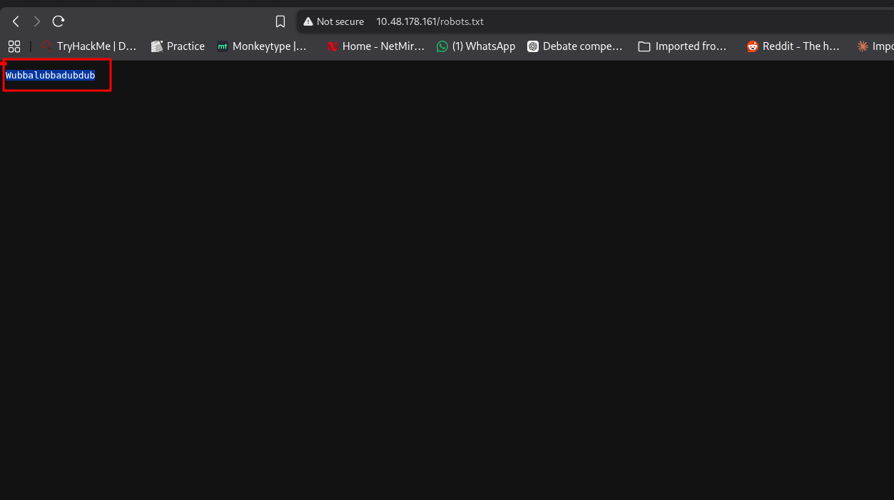

Instead of a standard disallow list, it contained a single, strange string: `Wubbalubbadubdub`. Given we already had a username, this strongly looked like a potential password.

---

## 🚪 Step 5: Initial Access
I navigated to the `login.php` page discovered via Gobuster. Using the credentials gathered during the enumeration phase:
* **User:** `R1ckRul3s`
* **Pass:** `Wubbalubbadubdub`

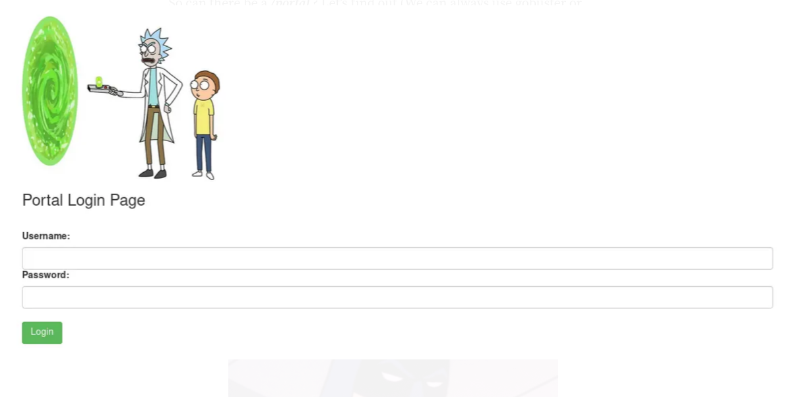

The credentials worked, granting access to a web-based "Command Panel"!

---

## 🚩 Step 6: Exploitation & Flag 1
The command panel acts as a web shell, allowing direct execution of Linux commands on the underlying server. 

First, I ran an `ls` command to see what was in the current directory.

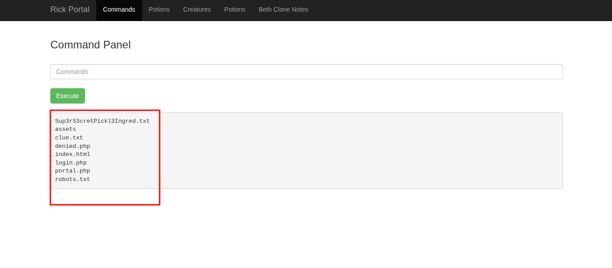

I noticed a file named `Sup3rS3cretPickl3Ingred.txt`. However, when I tried to read it using standard commands like `cat`, `head`, or `tail`, the application blocked the execution (a classic command filter). 

To bypass this filter, I used the `less` command to read the file contents.

```bash
less Sup3rS3cretPickl3Ingred.txt
```

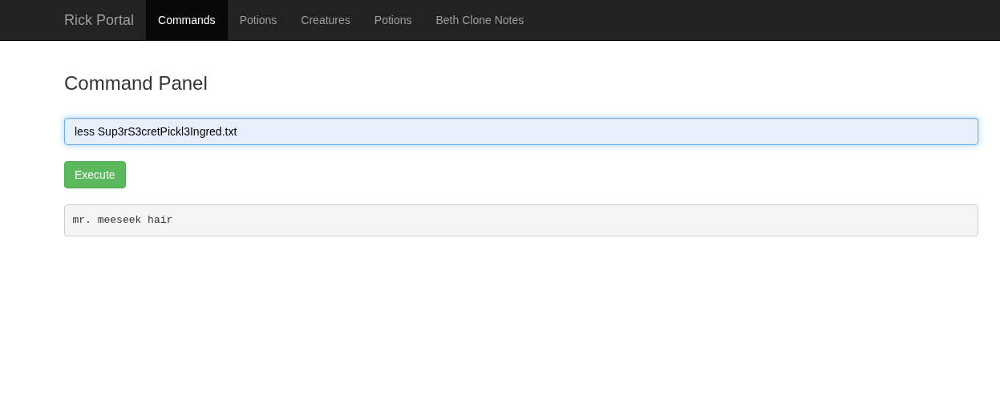

**Ingredient 1 obtained!** (`mr. meeseek hair`)

---

## 🚩 Step 7: The Second Ingredient
The current directory also contained a `clue.txt` file, which hinted that I needed to look through the rest of the file system. 

I navigated to the `/home/` directory and found a user folder named `rick`. Listing the contents of that directory revealed the second ingredient.

```bash
ls /home/rick/"second ingredients"
```

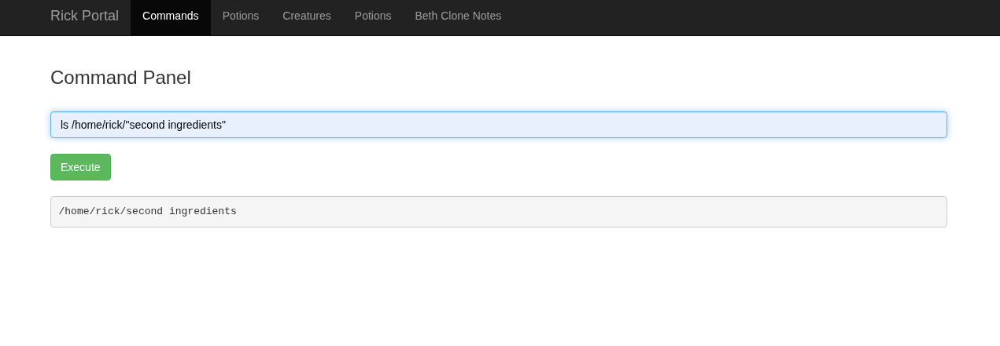

Using the same `less` bypass technique, I extracted the contents.

**Ingredient 2 obtained!** (`1 jerry tear`)

---

## 👑 Step 8: Privilege Escalation & Final Flag
To find the final ingredient, I needed to check what level of access I currently had. A standard check is to see if the current user (`www-data`) has any `sudo` privileges.

```bash
sudo -l
```

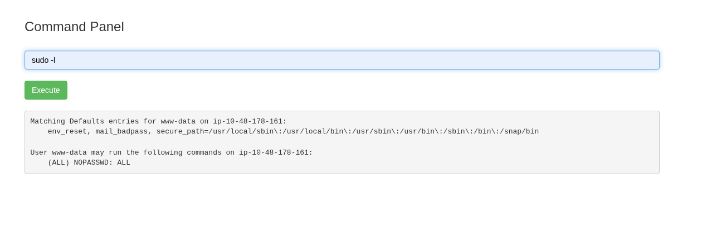

**Jackpot!** The output `(ALL) NOPASSWD: ALL` means our web user can execute *any* command as the root user without needing a password.

Knowing this, I ran an `ls` on the root directory (`sudo ls /root/`) and found `3rd.txt`. Using our root privileges, I read the final file:

```bash
sudo less /root/3rd.txt
```

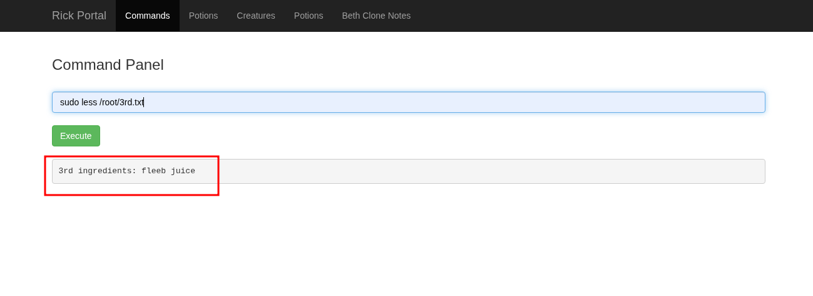

**Ingredient 3 obtained!** (`fleeb juice`) 

---

## 🎉 Conclusion
By combining basic web enumeration, bypassing a simple command filter, and utilizing misconfigured sudo privileges, all three ingredients were successfully recovered!

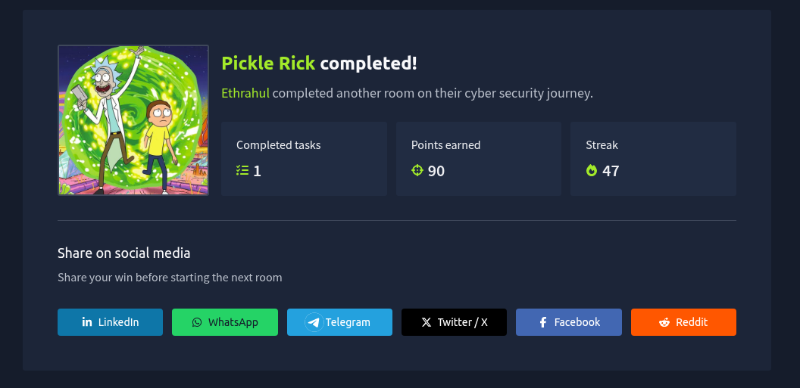

**Mission Accomplished.** 🥒
